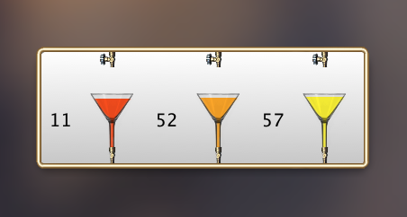
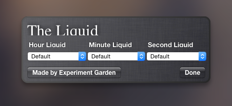

# liquid-clock

Mac OS X Dashboard Widget I created in about 2009. It was a learning project to experiment with DOM elements, JS
animations and style transitions, and to learn about JS timeouts and intervals.

The original project file is long lost, but the code from the widget is still available. Additionally the widget
can still be installed to the dashboard and functions as expected with only minor style issues on the back side
of the widget.

